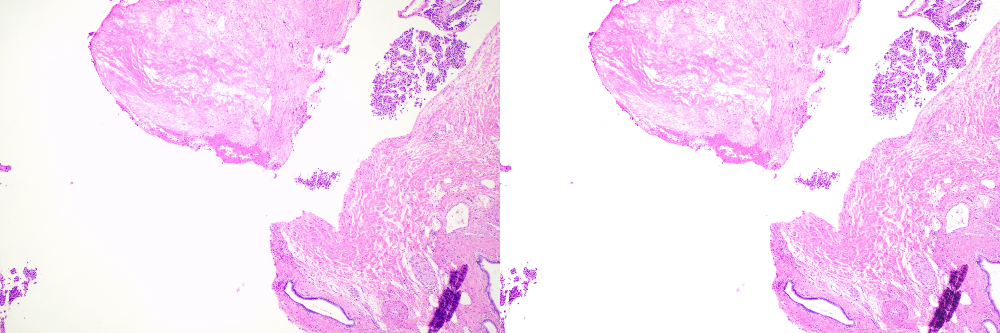

# VCLUT
Vignetting correction lookup table for color vignetting correction in microscopic images.

## Dependency

* CUDA 11.3
* python 3.8  (recommend to use [Anaconda](https://www.anaconda.com/))

## Demo

|  |  |
| :----------------------------------------: | :--------------------------------------: |
|  |  |
|  |  |
|            Pathological example            |            Leukocyte example             |

## How to run

### Step 0: Clone

```
git clone https://github.com/XuLabZJU/vCLUT.git
cd vCLUT
```

### Step 1: Environment

    pip install -r requirements.txt

### Step 2: Build

    cd trilinear_cpp
    sh setup.sh

> Warning: Modify the `setup.sh` according to your CUDA path

### Step 3: Run 

    python VCLUT_Demo.py

> Warning: Modify data type and file format

## Contact

If you have any questions, please contact: <yingkexu@zju.edu.cn>
